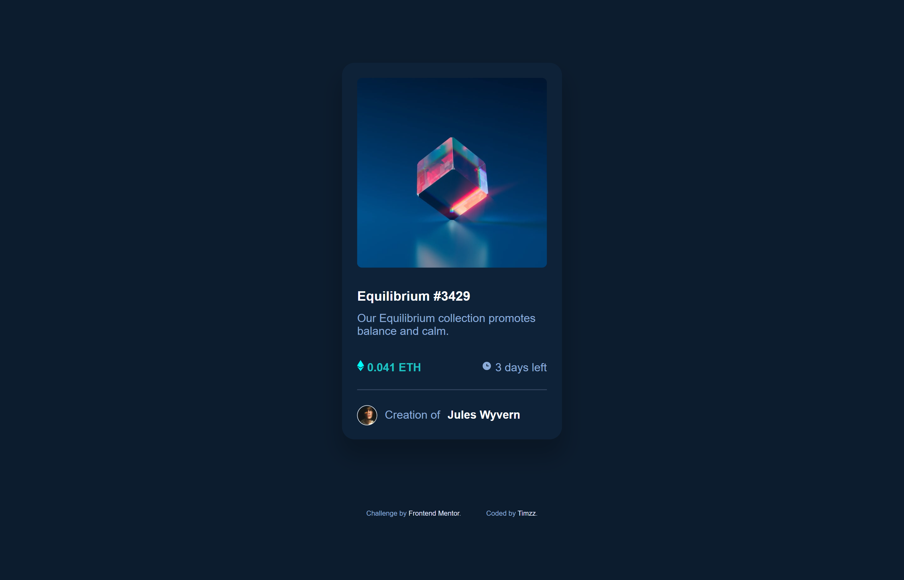
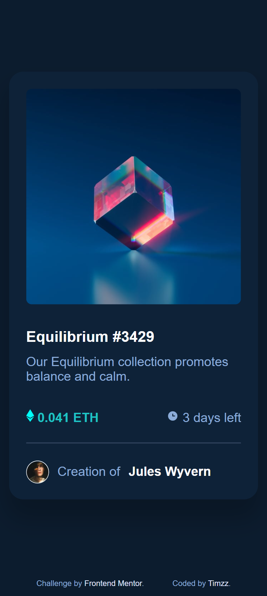

# Frontend Mentor - NFT preview card component solution

This is a solution to the [NFT preview card component challenge on Frontend Mentor](https://www.frontendmentor.io/challenges/nft-preview-card-component-SbdUL_w0U). Frontend Mentor challenges help you improve your coding skills by building realistic projects. 

## Table of contents

- [Overview](#overview)
  - [The challenge](#the-challenge)
  - [Screenshot](#screenshot)
  - [Links](#links)
- [My process](#my-process)
  - [Built with](#built-with)
  - [What I learned](#what-i-learned)
  - [Continued development](#continued-development)
  - [Useful resources](#useful-resources)
- [Author](#author)
- [Acknowledgments](#acknowledgments)


## Overview

### The challenge

Users should be able to:

- View the optimal layout depending on their device's screen size
- See hover states for interactive elements

### Screenshot




### Links

- Solution URL: [Github](https://your-solution-url.com)
- Live Site URL: [Netlify](https://your-live-site-url.com)

## My process

### Built with

- Semantic HTML5 markup
- CSS
- Flexbox
- Mobile-first workflow


### What I learned

I learnt about using adding an image over another image, creating an invisible element using css. I learnt how to add an horizontal line in html and styling it in css. I was able to remove the border and give the line a thickness and also change the color from the default color. In general, I understood the idea of the mobile first approach and why it is very important. I feel great, and looking forward to adding even more nft cards or even building a complete nft website.

```html
<div class="card_details">
        <a href="#"><h3>Equilibrium #3429</h3></a>

        <p>Our Equilibrium collection promotes balance and calm.</p>
        <div class="price_time">
          <h4> 0.041 ETH</h4>
          <p> 3 days left</p>
        </div>

<!-- adding horizontal line to webpage -->
        <hr style="color: #0c1c2e" />
```

```css
/* This was a really big deal for me...I literally yelled yes! when I got how to style the hr tag that has always proven difficult. Thanks to the internet. */


hr {
  height: 2px;
  background-color: hsl(215, 32%, 27%);
  border: none;
}

```


### Continued development

I still need to understand when to use the justify and align features of the css flexbox and how to use them properly. I also wasn't able to implement the eye icon on the active state. I'll keep learning to know how to manipulate that with html and css.


### Useful resources

- [Positioning image above another](https://www.w3docs.com/snippets/css/how-to-position-one-image-on-top-of-another-in-html-css.html) - This particularly proved useful while I was trying to place the eye icon over the nft (equilibrum) image.

- [Styling hr tag](https://www.w3docs.com/snippets/html/how-to-change-the-color-of-an-hr-element.html) - This is an amazing article which helped me finally understand ow to style the <hr> tag. I'd recommend it to anyone still learning this concept.


## Author

- Frontend Mentor - [@Timzz-a](https://www.frontendmentor.io/profile/Timzz-a)
- Twitter - [@timzz_a](https://www.twitter.com/timzz_a)


## Acknowledgments

Shoutout to the organisers of the challenge at Frontend mentor, the frontend tutors at Altschool Africa for their detailed explanation of HTML and CSS. I was able to follow best practices because of their worldclass experience. Special shoutout to Setemi, our live class tutor for always explaining to our understanding.


